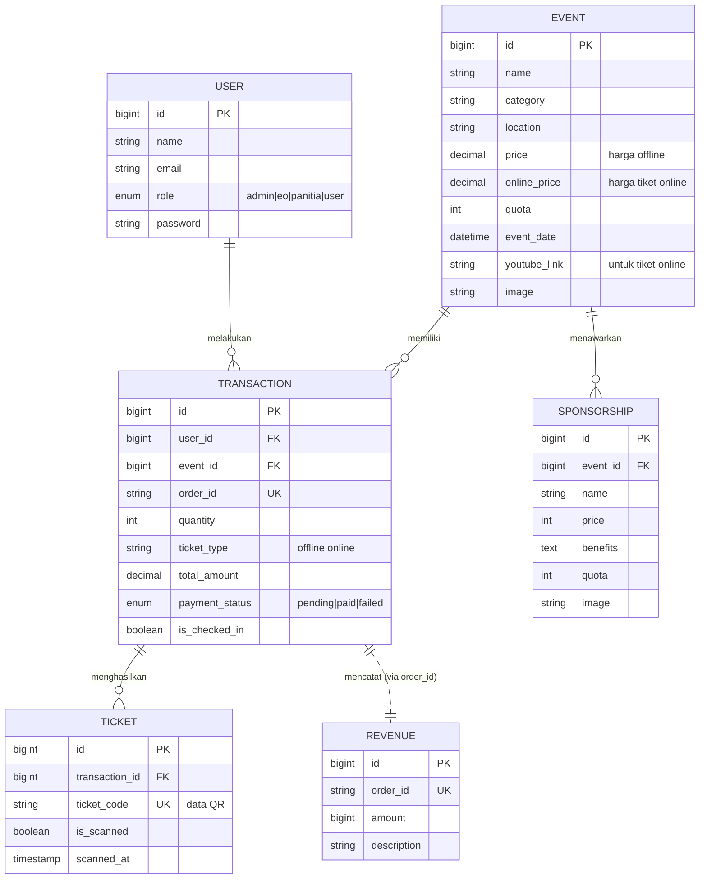
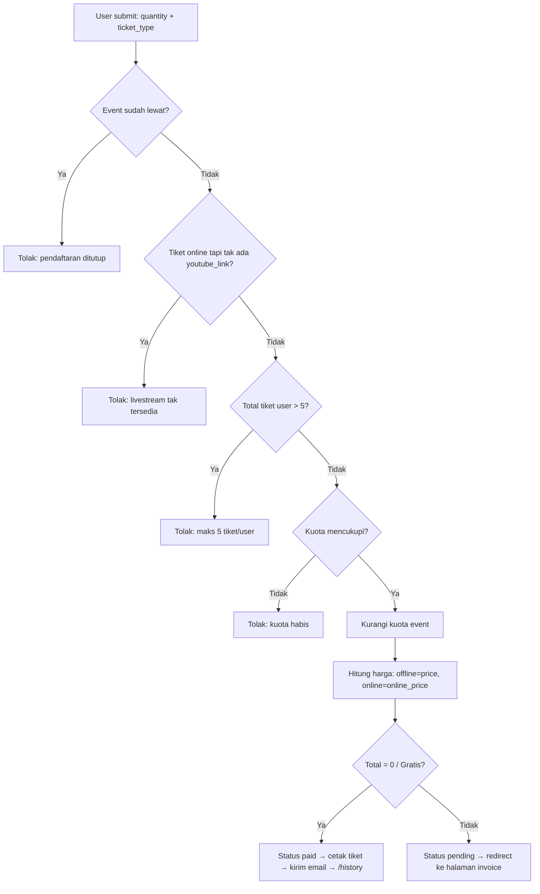
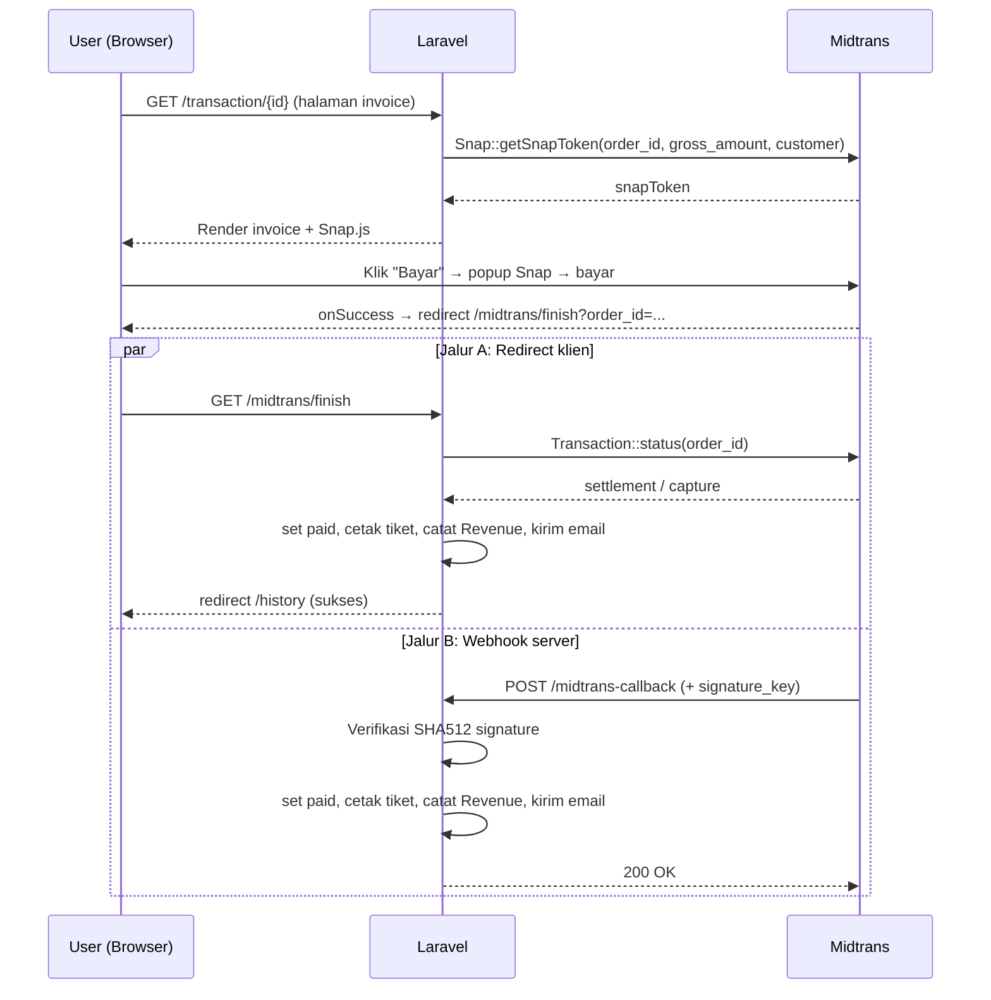
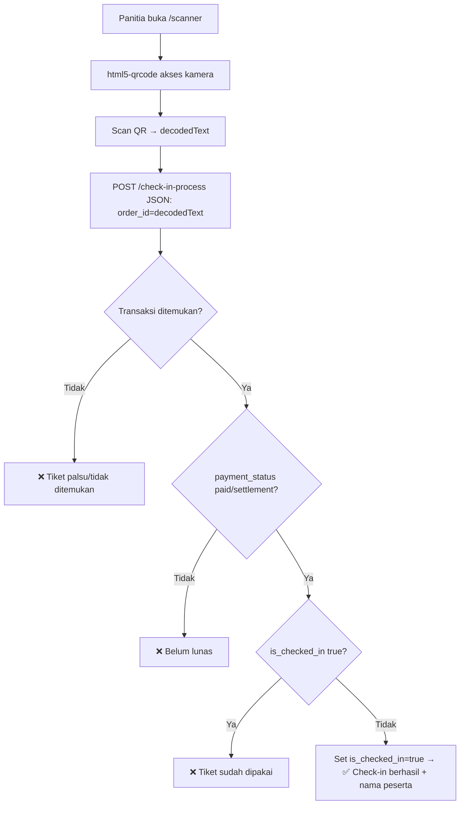

# Arsitektur & Alur Bisnis — TICKS ID (Ticketing Mitra)

> Dokumentasi teknis sistem tiket event **TICKS ID**: platform manajemen tiket event, pembayaran online, e-ticket QR Code, check-in di lapangan, marketplace sponsorship, dan dashboard analitik.

---

## 1. Ringkasan Eksekutif

**TICKS ID** adalah aplikasi web monolitik berbasis **Laravel 9** untuk penjualan dan pengelolaan tiket event. Sistem melayani empat peran pengguna (Admin, Event Organizer, Panitia, User) dengan alur inti:

1. **User** menjelajahi daftar event → memesan tiket (offline/online) → membayar via **Midtrans**.
2. Setelah lunas, sistem otomatis **mencetak e-ticket ber-QR Code** dan mengirimkannya sebagai **lampiran PDF via email**.
3. **Panitia** memindai QR Code peserta di lokasi acara untuk **check-in**.
4. **EO/Admin** mengelola event, sponsorship, transaksi, dan memantau pendapatan lewat **dashboard**.

Aplikasi juga menyediakan **marketplace paket sponsorship** dan tiket **online/livestream** (via link YouTube) untuk kategori event tertentu.

---

## 2. Tech Stack

| Lapisan | Teknologi | Keterangan |
|---|---|---|
| **Framework** | Laravel 9.19 (PHP ^8.0.2) | Pola arsitektur MVC |
| **Database** | MySQL | Nama DB dump: `ticketing_mitra` (lihat `ticketing_mitra.sql`) |
| **ORM** | Eloquent | Model & relasi |
| **Autentikasi** | Laravel Breeze + Sanctum | Scaffolding auth + token API |
| **Payment Gateway** | Midtrans (`midtrans/midtrans-php` ^2.6) | Mode **Snap** (sandbox) |
| **PDF** | `barryvdh/laravel-dompdf` ^2.2 | Generate e-ticket & invoice PDF |
| **QR Code** | `simplesoftwareio/simple-qrcode` ^4.2 (terpasang) + **api.qrserver.com** (dipakai di view) | Generate QR pada tiket |
| **Frontend** | Blade + Tailwind CSS + Alpine.js + Vite | Sebagian view memakai Bootstrap 5 via CDN |
| **QR Scanner** | `html5-qrcode` (CDN) | Scanner berbasis kamera di browser |
| **Email** | Laravel Mail (SMTP / Mailpit) | Pengiriman e-ticket |

**Pustaka frontend via CDN:** Bootstrap 5, Bootstrap Icons, Google Fonts (Inter, Syne), Tailwind Play CDN (di halaman scanner), `html5-qrcode`, Midtrans Snap.js.

---

## 3. Arsitektur Tingkat Tinggi

Aplikasi mengikuti pola **MVC klasik Laravel** (monolith server-rendered). Tidak ada pemisahan API/SPA — sebagian besar interaksi berupa request HTTP tradisional yang mengembalikan Blade view, dengan beberapa endpoint JSON (scanner check-in & callback Midtrans).

```
┌──────────────────────────────────────────────────────────────────────┐
│                             BROWSER / KLIEN                            │
│   Blade Views (Tailwind/Bootstrap) · Alpine.js · html5-qrcode         │
│   Midtrans Snap.js (popup pembayaran)                                  │
└───────────────┬───────────────────────────────────┬──────────────────┘
                │ HTTP (web)                          │ HTTP JSON
                ▼                                     ▼
┌──────────────────────────────────────────────────────────────────────┐
│                          ROUTING (routes/web.php)                      │
│   Middleware: auth · guest · role:{admin,eo,panitia,user}             │
└───────────────┬───────────────────────────────────────────────────────┘
                ▼
┌──────────────────────────────────────────────────────────────────────┐
│                            CONTROLLERS                                 │
│  Checkout · CheckIn · AdminEvent · AdminTransaction · AdminUser ·     │
│  Sponsorship · Profile · Auth\*                                        │
└───────────────┬───────────────────────────────────────────────────────┘
                ▼
┌──────────────────────────────────────────────────────────────────────┐
│                     MODEL / DOMAIN (Eloquent)                         │
│      User · Event · Transaction · Ticket · Revenue · Sponsorship      │
└───────────────┬───────────────────────────────────────────────────────┘
                ▼
┌──────────────────────────────────────────────────────────────────────┐
│                          MySQL DATABASE                               │
└──────────────────────────────────────────────────────────────────────┘

        INTEGRASI EKSTERNAL:
        ├── Midtrans (Snap token, callback signature, cek status)
        ├── DomPDF (render PDF e-ticket & invoice)
        ├── SMTP / Mailpit (kirim email + lampiran PDF)
        └── api.qrserver.com (render gambar QR di PDF/email)
```

### Struktur Direktori Penting

```
app/
├── Http/
│   ├── Controllers/
│   │   ├── CheckoutController.php        # Inti: checkout, Midtrans, cetak tiket, PDF
│   │   ├── CheckInController.php         # Proses scan QR & check-in
│   │   ├── AdminEventController.php      # Dashboard + CRUD event
│   │   ├── AdminTransactionController.php# Daftar transaksi (EO/Admin)
│   │   ├── AdminUserController.php       # Kelola pengguna (Admin)
│   │   ├── SponsorshipController.php     # CRUD paket sponsor
│   │   ├── ProfileController.php         # Profil user (Breeze)
│   │   └── Auth/                         # Login, register, reset password (Breeze)
│   └── Middleware/
│       └── RoleMiddleware.php            # Otorisasi berbasis role (RBAC)
├── Models/
│   ├── User.php · Event.php · Transaction.php
│   ├── Ticket.php · Revenue.php · Sponsorship.php
└── Mail/
    └── TicketMail.php                    # Mailable e-ticket (lampiran PDF)

routes/
├── web.php                               # Rute utama aplikasi
├── auth.php                              # Rute autentikasi (Breeze)
└── api.php                               # Endpoint API minimal (Sanctum)

resources/views/
├── events/          (index, show)        # Katalog & detail event (publik)
├── transactions/    (show, history, pdf_ticket)
├── emails/ticket.blade.php               # Template e-ticket
├── admin/           (dashboard, events/, sponsorships/, transactions/, users/, scanner)
└── eo/dashboard.blade.php                # Dashboard EO/Admin

database/migrations/                       # Skema evolusioner (lihat §6)
```

---

## 4. Model Domain & Relasi



### Ringkasan Relasi (Eloquent)

| Model | Relasi |
|---|---|
| **User** | `hasMany` Transaction (implisit lewat `user_id`) |
| **Event** | `hasMany` Transaction · `hasMany` Sponsorship |
| **Transaction** | `belongsTo` Event · `belongsTo` User · `hasMany` Ticket |
| **Ticket** | `belongsTo` Transaction |
| **Sponsorship** | `belongsTo` Event |
| **Revenue** | Tidak ada relasi Eloquent — dihubungkan secara longgar ke Transaction lewat kolom `order_id` |

**Catatan penting:**
- Satu **Transaction** dapat menghasilkan **banyak Ticket** (satu tiket QR unik per kuantitas yang dibeli).
- **Revenue** adalah tabel pembukuan terpisah, hanya diisi saat pembayaran benar-benar lunas (sumber data grafik pendapatan dashboard).

---

## 5. Peran Pengguna & Otorisasi (RBAC)

Otorisasi diterapkan lewat kolom `users.role` (enum) dan `RoleMiddleware` custom (terdaftar sebagai alias `role` di `app/Http/Kernel.php`).

| Role | Hak Akses |
|---|---|
| **user** (default) | Jelajah event, checkout, bayar, lihat riwayat & unduh tiket, kelola profil |
| **panitia** | Semua hak `user` + akses **Scanner check-in** |
| **eo** (Event Organizer) | Akses **Dashboard**, **CRUD Event**, **Sponsorship**, **lihat Transaksi**, + Scanner |
| **admin** | Semua hak `eo` + **Kelola Pengguna** (lihat & hapus akun) |

**Cara pakai middleware** (mendukung multi-role):
```php
Route::middleware(['auth', 'role:admin,eo,panitia'])->group(...);   // Scanner
Route::middleware(['auth', 'role:admin,eo'])->prefix('admin')->...; // Dashboard & CRUD
Route::middleware(['auth', 'role:admin'])->prefix('admin')->...;    // Kelola user
```

`RoleMiddleware` mengecek `in_array(Auth::user()->role, $roles)`; jika tidak cocok → `abort(403)`.

### Redirect Cerdas Setelah Login
`AuthenticatedSessionController@store` mengarahkan pengguna berdasarkan role (bukan `intended()`):

```
admin / eo  → /admin/events
panitia     → /scanner
user        → /  (halaman depan)
```

> Registrasi baru (`RegisteredUserController`) **selalu** membuat role default `user` dan redirect ke `HOME` (`/`). Promosi role (mis. jadi `eo`/`panitia`) dilakukan manual di database — tidak ada UI-nya.

---

## 6. Skema Database

Skema dibangun secara **evolusioner** lewat migration (tabel dasar + serangkaian `ALTER`). Berikut bentuk akhir tabel domain inti:

### `events`
| Kolom | Tipe | Catatan |
|---|---|---|
| id | bigint PK | |
| name | string | |
| description | text (nullable) | |
| image | string (nullable) | path poster di `storage/app/public/event-posters` |
| category | string | mis. `LIVE CONCERT`, `WORKSHOP`, `Sport Event` |
| location | string (nullable) | |
| price | decimal(15,2) default 0 | harga tiket **offline** (0 = gratis) |
| online_price | decimal(15,2) default 0 | harga tiket **online/livestream** |
| quota | integer | sisa kuota tiket |
| event_date | dateTime | |
| youtube_link | string (nullable) | wajib untuk mengaktifkan tiket online |
| timestamps | | |

### `transactions`
| Kolom | Tipe | Catatan |
|---|---|---|
| id | bigint PK | |
| user_id | FK → users (cascade) | |
| event_id | FK → events (cascade) | |
| order_id | string unique | format `TRX-XXXXXXXXXX`, dipakai sebagai order id Midtrans |
| quantity | integer | maks. 5 tiket per user per event |
| ticket_type | string default `offline` | `offline` \| `online` |
| total_amount | decimal(15,2) | |
| payment_status | enum `pending`\|`paid`\|`failed` | status kanonik pembayaran |
| is_checked_in | boolean default false | ditandai saat scan QR di lokasi |
| status | string default `pending` | *kolom warisan, tidak dipakai logika (lihat §11)* |
| timestamps | | |

### `tickets`
| Kolom | Tipe | Catatan |
|---|---|---|
| id | bigint PK | |
| transaction_id | FK → transactions (cascade) | |
| ticket_code | string unique | isi QR Code; format `{order_id}-XXXX` |
| is_scanned | boolean default false | *disiapkan namun belum di-update logika check-in (lihat §11)* |
| scanned_at | timestamp (nullable) | |
| timestamps | | |

### `sponsorships`
| Kolom | Tipe |
|---|---|
| id | bigint PK |
| event_id | FK → events (cascade) |
| name | string (nama paket, mis. "Platinum") |
| price | integer |
| benefits | text |
| quota | integer default 1 |
| image | string (nullable) |
| timestamps | |

### `revenues`
| Kolom | Tipe | Catatan |
|---|---|---|
| id | bigint PK | |
| order_id | string unique | referensi longgar ke `transactions.order_id` |
| amount | bigInteger | nominal pendapatan diterima |
| description | string (nullable) | |
| timestamps | | dipakai untuk grafik pendapatan bulanan |

### `users`
Tabel bawaan Laravel + kolom `role` (enum `admin|eo|panitia|user`, default `user`).

---

## 7. Peta Routing

### Rute Publik (tanpa login)
| Method | URI | Aksi |
|---|---|---|
| GET | `/` | Katalog event + pencarian (`search`, `location`) + daftar sponsorship |
| GET | `/event/{id}` | Detail event |
| POST | `/midtrans-callback` | **Webhook** callback pembayaran Midtrans (server-to-server) |
| GET | `/midtrans/finish` | Redirect kembali dari Snap → verifikasi status |

### Rute Terautentikasi (semua role)
| Method | URI | Aksi |
|---|---|---|
| POST | `/checkout/{id}` | Proses pemesanan tiket |
| GET | `/transaction/{id}` | Halaman invoice/pembayaran (Snap) |
| GET | `/history` | Riwayat transaksi user |
| GET | `/download-ticket/{id}` | Unduh e-ticket PDF |
| GET/PATCH/DELETE | `/profile` | Kelola profil |

### Rute Scanner (`role:admin,eo,panitia`)
| Method | URI | Aksi |
|---|---|---|
| GET | `/scanner` | Halaman kamera scanner |
| POST | `/check-in-process` | Endpoint JSON validasi & check-in |

### Rute Admin/EO (`role:admin,eo`, prefix `/admin`)
| Method | URI | Aksi |
|---|---|---|
| GET | `/admin/dashboard` | Statistik & grafik |
| GET/POST/PUT/DELETE | `/admin/events...` | CRUD event |
| GET | `/admin/transactions` | Daftar semua transaksi |
| GET/POST/PUT/DELETE | `/admin/sponsorships...` | CRUD sponsorship |

### Rute Admin-only (`role:admin`)
| Method | URI | Aksi |
|---|---|---|
| GET | `/admin/users` | Daftar pengguna |
| DELETE | `/admin/users/{id}` | Hapus akun (tidak bisa hapus diri sendiri) |

---

## 8. Alur Bisnis Utama

### 8.1 Autentikasi & Registrasi
1. Pengunjung mendaftar (`/register`) → dibuat sebagai role `user`, langsung login, redirect ke `/`.
2. Login (`/login`) → redirect sesuai role (lihat §5).
3. Manajemen sesi & reset password ditangani scaffolding Breeze (`routes/auth.php`).

### 8.2 Penemuan Event (Discovery)
- Halaman `/` menampilkan seluruh event (terbaru dulu) + katalog paket sponsorship.
- Pencarian: filter `name`/`category` (kata kunci) dan `location`.
- `/event/{id}` menampilkan detail + form pemesanan.

### 8.3 Checkout & Penentuan Harga
`CheckoutController@processCheckout` dibungkus **`DB::transaction`** dengan **`lockForUpdate`** pada event (mencegah race condition kuota). Validasi berurutan:



Poin kunci:
- **Harga** ditentukan tipe tiket: `offline` → `event.price`; `online` → `event.online_price` (fallback 0).
- **Batas 5 tiket** dihitung dari akumulasi transaksi berstatus `pending`+`paid` untuk user & event tsb.
- **Kuota dikurangi saat checkout** (bahkan saat masih `pending`).
- **Tiket gratis (Rp 0)** melewati Midtrans — langsung `paid`, tiket dicetak, email dikirim.

### 8.4 Pembayaran via Midtrans (tiket berbayar)



Dua jalur konfirmasi yang **idempoten** (aman jika keduanya jalan):
- **`callback()`** — webhook server-to-server; memverifikasi `signature_key` = `sha512(order_id + status_code + gross_amount + serverKey)`.
- **`finish()`** — dipanggil saat browser kembali dari Snap; memanggil `Midtrans\Transaction::status()` untuk konfirmasi.

Keduanya melindungi diri dengan guard `payment_status != 'paid'` dan `tickets->count() == 0`, serta `Revenue::firstOrCreate` (mencegah double posting pendapatan). Status `deny/expire/cancel` → `payment_status = failed`.

### 8.5 Pencetakan Tiket & Pengiriman E-Ticket
Saat transaksi menjadi `paid` (via gratis, callback, atau finish):
1. **"Mesin pencetak tiket"** membuat N baris `Ticket` (N = `quantity`), masing-masing dengan `ticket_code = {order_id}-XXXX` unik.
2. `Revenue` dicatat (hanya untuk transaksi berbayar).
3. **`TicketMail`** dikirim ke email user: berisi body HTML e-ticket **dan lampiran PDF** yang dirender DomPDF dari `emails/ticket.blade.php`.
4. QR Code pada tiket dirender lewat `api.qrserver.com` dengan data = `ticket_code`.

User juga dapat mengunduh PDF kapan saja lewat `GET /download-ticket/{id}` (`downloadTicket`), dengan guard: hanya pemilik transaksi & hanya jika `paid`.

### 8.6 Check-in di Lokasi (Scanner)



Frontend scanner (`admin/scanner.blade.php`) memakai `html5-qrcode` dengan debounce 3 detik antar-scan, dan menampilkan hasil sukses (hijau) / gagal (merah).

### 8.7 Manajemen Event (EO/Admin)
`AdminEventController` menyediakan CRUD penuh:
- **Aturan hybrid:** hanya kategori `LIVE CONCERT`, `WORKSHOP`, `STAND UP COMEDY` yang boleh punya `youtube_link` + `online_price`; kategori lain dipaksa `online_price = 0` & `youtube_link = null`.
- Upload poster disimpan ke disk `public` (`event-posters/`); poster lama dihapus saat update/hapus event.

### 8.8 Marketplace Sponsorship
`SponsorshipController` — CRUD paket sponsor per event (nama, harga, benefit, kuota, gambar). Paket ditampilkan di halaman publik `/`. **Belum ada alur transaksi/pembelian sponsor** — murni katalog + manajemen konten.

### 8.9 Dashboard & Analitik (EO/Admin)
`AdminEventController@dashboard` mengagregasi:
- **Total Pendapatan** = `SUM(revenues.amount)`.
- **Tiket Terjual** = `SUM(quantity)` transaksi `paid`.
- **Event Aktif** = `COUNT(events)`; **Total Pengguna** = `COUNT(users)`.
- **Pendapatan Sponsor** = `SUM(sponsorships.price)` *(estimasi kotor — lihat §11)*.
- **Grafik penjualan bulanan 2026** (dari `revenues`, dalam juta rupiah).
- **Distribusi per kategori** (join transaksi `paid` × event).

### 8.10 Manajemen Pengguna (Admin)
`AdminUserController` — daftar & hapus akun. Ada guard: admin **tidak bisa menghapus akunnya sendiri**.

---

## 9. Integrasi Eksternal

| Integrasi | Dipakai di | Keterangan |
|---|---|---|
| **Midtrans Snap** | `CheckoutController` (`show`/`callback`/`finish`), `transactions/show.blade.php` | Mode **sandbox** (`isProduction = false` hardcoded); Snap.js dari `app.sandbox.midtrans.com` |
| **DomPDF** | `TicketMail`, `downloadTicket` | Render e-ticket & memungkinkan unduh invoice/tiket |
| **Email (SMTP/Mailpit)** | `TicketMail` | Kirim e-ticket + lampiran PDF; default dev via Mailpit (`127.0.0.1:1025`) |
| **api.qrserver.com** | `emails/ticket.blade.php`, `pdf_ticket.blade.php` | Render gambar QR (butuh internet saat generate PDF) |
| **html5-qrcode** | `admin/scanner.blade.php` | Scanner QR berbasis kamera browser |

---

## 10. Konfigurasi & Environment

Variabel penting (`.env`):
```
DB_CONNECTION=mysql · DB_DATABASE=... · DB_USERNAME=... · DB_PASSWORD=...
MAIL_MAILER=smtp · MAIL_HOST=... · MAIL_PORT=... · MAIL_FROM_ADDRESS=...
MIDTRANS_SERVER_KEY=...        # dibaca via env() di CheckoutController
MIDTRANS_CLIENT_KEY=...        # dibaca via config('midtrans.client_key') di view invoice
```

**Setup singkat (development):**
```bash
composer install
npm install
cp .env.example .env
php artisan key:generate
php artisan migrate           # atau import ticketing_mitra.sql
php artisan storage:link      # agar poster/gambar publik dapat diakses
npm run dev                   # Vite dev server
php artisan serve
```
> Seeder `EventSeeder` menyediakan 3 event contoh (termasuk satu event gratis untuk uji alur Rp 0). `DatabaseSeeder` default kosong — panggil `EventSeeder` manual bila diperlukan.

---

## 11. Catatan & Temuan Teknis

Observasi yang relevan untuk pemeliharaan/perbaikan ke depan:

1. **⚠️ Ketidakcocokan data QR vs lookup check-in.** QR Code berisi `ticket_code` (`{order_id}-XXXX`), tetapi `CheckInController` mencari `Transaction::where('order_id', $decodedText)`. Karena `ticket_code` punya sufiks `-XXXX`, pencocokan **tidak akan ketemu** kecuali QR memang di-set berisi `order_id` polos. Perlu diselaraskan (cari via `tickets.ticket_code`, atau isi QR dengan `order_id`).

2. **Check-in per-transaksi, bukan per-tiket.** Status kehadiran ditandai di `transactions.is_checked_in`, sedangkan kolom `tickets.is_scanned` / `scanned_at` disiapkan tetapi tidak pernah di-update. Akibatnya satu scan menandai **seluruh** transaksi (multi-tiket) sekaligus.

3. **🔒 Route debug berisiko.** `GET /debug-paid/{id}` (`debugPaid`) menandai transaksi apa pun jadi `paid` + cetak tiket + kirim email **tanpa cek kepemilikan** — hanya butuh login. Route `/test-email-qr` & `/tes-langsung` juga rute uji yang sebaiknya dihapus di produksi.

4. **Kuota tidak dikembalikan saat gagal.** Kuota event dikurangi saat checkout (status `pending`). Jika pembayaran `expire`/`cancel`/`failed`, kuota **tidak di-restock**, sehingga tiket bisa "terkunci" oleh transaksi yang tak pernah dibayar.

5. **Kolom `transactions.status` warisan.** Ditambahkan lewat migration namun tidak dipakai logika mana pun; status kanonik adalah `payment_status`.

6. **Inkonsistensi konfigurasi Midtrans.** Controller membaca `env('MIDTRANS_SERVER_KEY')` langsung (tidak aman untuk `config:cache`), sementara view memakai `config('midtrans.client_key')` — namun file `config/midtrans.php` tidak ada di repo. Sebaiknya buat file config khusus dan konsisten memakai `config()`.

7. **Mode sandbox hardcoded.** `isProduction = false` ditetapkan di kode; untuk produksi perlu dijadikan dependen environment.

8. **"Pendapatan Sponsor" di dashboard = jumlah semua harga paket**, bukan sponsor yang benar-benar terjual (belum ada alur transaksi sponsor). Angka ini bersifat estimasi/placeholder.

9. **`HomeController` & `welcome.blade.php` tampak warisan/tidak terpakai** — route `/` memakai closure yang mengembalikan `events.index`, bukan `HomeController@index`.

10. **Sistem desain** terdokumentasi di `DESIGN.md` (tema "Stripi-inspired"); token warna/tipografinya diterapkan langsung sebagai CSS variable di beberapa view (mis. `transactions/show.blade.php`).

---

*Dokumen ini dihasilkan dari pembacaan langsung atas kode sumber (routes, controllers, models, migrations, views) pada branch `main`.*
